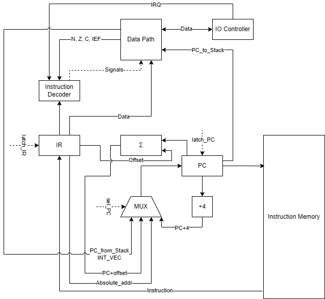
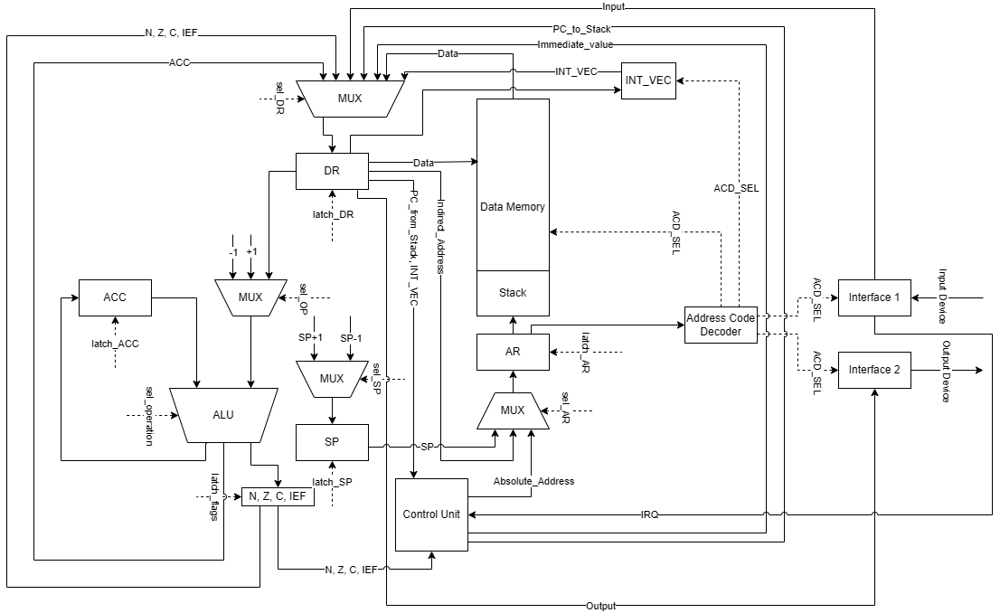

# Лабораторная работа №4

- **ФИО:** Зыков Андрей Алексеевич
- **Группа:** P3206
- **Вариант:** asm | acc | harv | hw | tick | binary | trap | mem | cstr | alg2 | ~~pipeline~~

## Язык программирования

---

### Расширенная форма Бэкуса-Наура

```
<program> ::= { <section_data> | <section_text> | <directive_line> | <preprocessor_line> | <empty_or_comment_line> }

<section_data> ::= ".section" ".data" "\n" { <data_line> | <directive_line> | <preprocessor_line> }

<data_line> ::= [ <label_def> ] [ <data_declaration> ] [ <comment> ] "\n"

<data_declaration> ::= <word_directive> | <string_directive>

<word_directive> ::= ".word" <word_list>
<word_list> ::= <number_or_label> { "," <number_or_label> }

<string_directive> ::= ".string" <string_literal>
<string_literal> ::= '"' { <any_char_except_quote> | <escape_seq> } '"'
<escape_seq> ::= "\\n" | "\\t" | "\\\\" | "\\\""

<section_text> ::= ".section" ".text" "\n" { <code_line> | <directive_line> | <preprocessor_line> }

<code_line> ::= [ <label_def> ] [ <statement> ] [ <comment> ] "\n"

<statement> ::= <instruction> | <macro_call>

<directive_line> ::= <directive> [ <comment> ] "\n"
<directive> ::= ".org" <number> | ".equ" <identifier> <number>

<label_def> ::= <identifier> ":"

<instruction> ::= <op_without_operand> | <op_with_operand> <operand>

<macro_call> ::= <identifier>

<op_without_operand> ::= "halt" | "not" | "ret" | "push" | "pop" | "ei" | "di" | "iret" | "inc" | "dec" | "nop"

<op_with_operand> ::= "load" | "store" | "add" | "sub" | "and" | "or" | "jmp" | "jz" | "jn" | "call" | "jc" | "jnc"

<operand> ::= <absolute_operand>
            | <immediate_operand>
            | <indirect_operand>
            | <relative_operand>

<absolute_operand> ::= <number_or_label>

<immediate_operand> ::= "#" <number_or_label>

<indirect_operand> ::= "[" <number_or_label> "]"

<relative_operand>  ::= "@" <identifier>

<number_or_label> ::= <number> | <identifier>

<number> ::= <decimal> | <hexadecimal>
<decimal> ::= ["-"] <digit> { <digit> }
<hexadecimal> ::= "0x" <hex_digit> { <hex_digit> }

<digit> ::= "0" ... "9"
<hex_digit> ::= <digit> | "a" ... "f" | "A" ... "F"

<identifier> ::= <letter> { <letter_or_digit> }
<letter> ::= "a" ... "z" | "A" ... "Z"
<letter_or_digit> ::= <letter> | <digit> | "_"

<comment> ::= ";" { <any_character_except_newline> }
<empty_or_comment_line> ::= [ <comment> ] "\n"

<preprocessor_line> ::= <preprocessor_directive> [ <comment> ] "\n"
<preprocessor_directive> ::= <macro_directive> | <cond_directive>
<macro_directive> ::= ".macro" <identifier> | ".endmacro"
<cond_directive>  ::= ".if" <identifier> | ".else" | ".endif"

<any_char_except_quote> ::= ? любой символ, кроме " и \ ?
<any_character_except_newline> ::= ? любой символ, кроме символа новой строки ?
```

### Описание семантики

- **Стратегия вычислений:** строгая стратегия вычислений, аргументы всегда вычисляются полностью до применения функции к ним. Присутствуют **вызов по значению** (для непосредственной загрузки) и **вызов по сслыке** (для остальных видов адресации)
- **Области видимости:** глобальная область видимости, все метки, объявленные в секциях `.data` и `.text`, имеют глобальную область видимости, наличие двух одинаковых меток недопустимо. Аналогично глобальную область видимости имеют константы. На концептуальном уровне локальную видимость имеют переменные в стеке, так как актуальны в рамках текущей подпрограммы и недоступны при обращении по имени (не имеют меток). На физическом уровне переменную из стека все равно возможно получить через обращение по прямому адресу в памяти.
- **Типизация:** строгая типизация как таковая отсутствует, интерпретация машинного слова зависит от выполняемой над ним инструкции.
- **Виды литералов:** 
  * **Десятичные целочисленные:** знаковые целые числа в десятичной системе счисления (`10`, `-4`).
  * **Шестнадцатеричные целочисленные:** числа в шестнадцатеричной системе счисления, могут быть интерпретированы как знаковые и как беззнаковые. Начинаются с префикса `0x` (`0xFFFFFFFF`, `0x1FFFABC`)
  * **Строковые литералы:** представляют собой последовательности символов, заключенные в двойные кавычки (`"Hello"`, `"World!\n"`). Хранятся в формате C-String: последовательность символов оканчивается нуль-терминатором. Для хранения одного символа выделяется одно 32-битное машинное слово.
- **Пользовательские макроопределения:**
  * **Константы:** объявляются с помощью директивы `.equ`. Могут использоваться как операнды команд, не занимают памяти, так как все используемые значения заменяются транслятором на непосредственное значение.
  * **Макросы:** начинаются и заканчиваются директивами `.macro <identifier>` и `.endmacro`, соответственно. Тело макроса содержит некоторое количество инструкций, при трансляции все имена макросов заменяются на последовательность инструкций, определенную в их теле.
  * **Условная компиляция:** условно компилируемые фрагменты определяются тремя директивами: `.if <identifier>`, `.else`, `.endif`. В качестве условия (`<identifier>`) проверяется значение константы, определенной директивой `.equ`. Если значение константы равно 0 или константа не определена, код в теле `.if` игнорируется. Директива `.else` является опциональной и компилируется, если не было выполнено условие `.if`. Директива `.endif` показывает окончание блока условной компиляции


## Организация памяти

---

### Модель памяти

Гарвардская архитектура: 2 раздельных памяти для данных и для инструкций. Используются 32-битные машинные слова. Присутствуют несколько видов адресации: прямая, косвенная, относительная, непосредственная загрузка операнда.
- **Память данных:** размер 1024 ячейки. Хранит переменные, строки, стек.
- **Память команд:** размер 2^24 (адреса с `0x0` до `0xFFFFFF`), доступна только для чтения. Хранит инструкции.

Минимальная единица данных - машинное слово

```
       Instruction memory
+------------------------------+
| 0x00 : .org 0                |
| 0x00 : jmp main              |
| ...                          |
| 0x10 : .org 0x10             | обработчик прерывания
| 0x10 : push                  |
| 0x11 : ...                   |
| ...                          |
| 0x20 : main: load #0         |
| ...                          |
+------------------------------+

       Data memory
+------------------------------+
| 0x0000 : .data               |
| 0x0000 : x: .word 0          | 
| 0x0001 : y: .word 0          |
| 0x0002 : msg: .string "Hi"   | -> 0x0002: 'H', 0x0003: 'i', 0x0004: \0
| ...                          |
| 0x03FF : DataMem[SP]         | начало стека
| ...                          |
| 0xFFFFF0 : input port        |
| 0xFFFFF1 : output port       |
| 0xFFFFF2 : вектор прерывания |
+------------------------------+
```

- Порты ввода-вывода:
  * ```0xFFFFF0``` - порт ввода
  * ```0xFFFFF1``` - порт вывода
  * ```0xFFFFF2``` - вектор прерываний (по умолчанию ```0x10```)

### Регистры

| Регистр | Назначение         |
|---------|--------------------|
| PC      | Program Counter    |
| ACC     | Аккумулятор        |
| SP      | Stack Pointer      |
| PS      | Флаги Z, N, C, IEF |

### Флаги

| Флаг | Назначение                  |
|------|-----------------------------|
| Z    | Результат равен 0           |
| N    | Отрицательный результат     |
| C    | Перенос из старшего разряда |
| IEF  | Разрешены прерывания        |


### Виды адресации

| Режим адресации | Синтаксис | Описание                  |
|-----------------|-----------|---------------------------|
| Immediate       | `#imm`    | Непосредственная загрузка |
| Absolute        | `addr`    | Прямая адресация          |
| Indirect        | `[addr]`  | Косвенная адресация       |
| Relative        | `@offset` | Относительная адресация   |

### Размещение в памяти

- **Литералы:**
  * Литералы, укладывающиеся в 24 бита могут кодироваться непосредственно внутри самой инструкции при использовании режима непосредственной адресации `#imm` (`LOAD #10`, `ADD #1`). Не занимают места в памяти данных.
  * Числа, занимающие 32 бита или инициализирующиеся в секции `.data` занимают одну 32-битную ячейку памяти данных.
  * Символьные литералы преобразуются транслятором в целочисленные ASCII-коды и обрабатываются процессором как обычные числа.
  * Строковые литералы размещаются в памяти данных в формате C-String, каждый символ занимает одно машинное слово (младший байт).

- **Константы:**
  * Константы, объявленные через директиву `.equ` преобразуются на этапе трансляции и их текстовые имена заменяются числовыми значениями.

- **Переменные:**
  * Все переменные отображаются на память данных, начиная с адреса `0x0` (или с адреса, заданного директивой `.org`). 
  
- **Инструкции:**
  * Размещаются последовательно в памяти с инструкций, начиная с адреса `0x0` (или с адреса, заданного директивой `.org`). Все метки окончательно разрешаются на 2-м проходе транслятора.
  * Начало программы указывает метка `start:`

- **Процедуры:**
  * Все процедуры размещаются в памяти команд.
  * Вызов процедуры выполняется инструкцией `CALL` при этом значение `PC + 1` сохраняется в стек, а в `PC` записывается адрес начала подпрограммы.
  * Возврат из процедуры выполняется инструкцией `RET`, адрес возврата извлекается из стека и записывается в `PC`.
  * Изначально `SP` указывает на последнюю ячейку памяти, при добавлении в стек `SP` уменьшается на 1.

- **Прерывания:**
  * Обработчик прерываний располагается по адресу, указанному в векторе прерывания (`0x10`), в памяти инструкций.
  * При наступлении прерывания процессор сохраняет в стек `PC`, сохраняет флаги `Z, N, C`, устанавливает `IEF = 0` (для защиты от вложенных прерываний), читает вектор прерывания и устанавливает в `PC` адрес обработчика.
  * Для возврата из прерывания используется инструкция `IRET`. При использовании инструкции значения флагов `Z, N, C` и регистра `PC` восстанавливаются, извлекаясь из стека, флаг `IEF` устанавливается равным 1.

## Система команд

---
### Особенности процессора

- Аккумуляторная архитектура, работа строится вокруг специализированного регистра (`ACC`), куда сохраняется результат большинства операций
- Нет как таковой строгой типизации, значения могут интерпретироваться по-разному
- Гарвардская архитектура: память данных и память инструкций. Представлены несколько видов адресации
- Реализован Memory-Mapped IO. Ввод осуществляется по прерываниям
- Присутствуют инструкции управления потоком выполнения (различные виды переходов), инструкции для работы с прерываниями

### Формат инструкции

```
|31..28|27..24|23..0|
|opcode| mode | arg |
```
- **opcode** (4 бита) - код операции
- **mode** (4 бита) - режим адресации
- **arg** (24 бита) - аргумент инструкции (адрес или непосредственное значение операнда)

### Режимы адресации

| Режим     | Mode | Сокращение |
|-----------|------|------------|
| Absolute  | 0x0  | Abs        |
| Immediate | 0x1  | Imm        |
| Indirect  | 0x2  | Ind        |
| Relative  | 0x3  | Rel        |

Во всех командах с кодом операции `0xF` биты режима адресации используются как часть кода операции.

### Набор инструкций

| Инструкция | OPCODE (hex) | MODE (hex) | Полный цикл исполнения (тактов) | Режимы адресации    | Операнд | Семантика                                              |
|------------|--------------|------------|---------------------------------|---------------------|---------|--------------------------------------------------------|
| `NOP`      | `0x0`        | `0x0`      | 1                               | –                   | –       | Нет операции                                           | 
| `LOAD`     | `0x1`        | *          | 4(Abs), 3(Imm), 6(Ind)          | `Abs`, `Imm`, `Ind` | `<op>`  | `ACC = <op>`                                           |
| `STORE`    | `0x2`        | *          | 3(Abs), 6(Ind)                  | `Abs`, `Ind`        | `<op>`  | `DataMemory[<op>] = ACC`                               |
| `ADD`      | `0x3`        | *          | 4(Abs), 3(Imm), 6(Ind)          | `Abs`, `Imm`, `Ind` | `<op>`  | `ACC = ACC + <op>`; set `Z, N, C`                      |
| `SUB`      | `0x4`        | *          | 4(Abs), 3(Imm), 6(Ind)          | `Abs`, `Imm`, `Ind` | `<op>`  | `ACC = ACC - <op>`; set `Z, N, C`                      |
| `AND`      | `0x5`        | *          | 4(Abs), 3(Imm), 6(Ind)          | `Abs`, `Imm`, `Ind` | `<op>`  | `ACC = ACC & <op>`; set `Z, N`                         |
| `OR`       | `0x6`        | *          | 4(Abs), 3(Imm), 6(Ind)          | `Abs`, `Imm`, `Ind` | `<op>`  | `ACC = ACC \| <op>`; set `Z, N`                        |
| `JMP`      | `0x7`        | *          | 2(Abs), 2(Rel)                  | `Abs`, `Rel`        | `<op>`  | `PC = <op>`                                            |
| `JZ`       | `0x8`        | *          | 2(Abs), 2(Rel)                  | `Abs`, `Rel`        | `<op>`  | `PC = <op>`, если `Z == 1`                             |
| `JN`       | `0x9`        | *          | 2(Abs), 2(Rel)                  | `Abs`, `Rel`        | `<op>`  | `PC = <op>`, если `N == 1`                             |
| `JC`       | `0xA`        | *          | 2(Abs), 2(Rel)                  | `Abs`, `Rel`        | `<op>`  | `PC = <op>`, если `C == 1`                             |
| `JNC`      | `0xB`        | *          | 2(Abs), 2(Rel)                  | `Abs`, `Rel`        | `<op>`  | `PC = <op>`, если `C == 0`                             |
| `CALL`     | `0xC`        | *          | 3(Abs), 3(Rel)                  | `Abs`, `Rel`        | `<op>`  | `PUSH(PC+1)`; `PC = <op>`                              |
| `PUSH`     | `0xD`        | –          | 3                               | –                   | –       | `DataMemory[SP] = ACC`; `SP--`                         |
| `POP`      | `0xE`        | –          | 5                               | –                   | –       | `SP++`, `ACC = DataMemory[SP]`                         |
| `EI`       | `0xF`        | `0x0`      | 2                               | –                   | –       | `IEF = 1`                                              |
| `DI`       | `0xF`        | `0x1`      | 2                               | –                   | –       | `IEF = 0`                                              |
| `IRET`     | `0xF`        | `0x2`      | 9                               | –                   | –       | Восстановить `Z,N,C` из стека, `PC = POP()`, `IEF = 1` |
| `INC`      | `0xF`        | `0x3`      | 2                               | –                   | –       | `ACC = ACC + 1`; set `Z, N`                            |
| `DEC`      | `0xF`        | `0x4`      | 2                               | –                   | –       | `ACC = ACC - 1`; set `Z, N`                            |
| `NOT`      | `0xF`        | `0x5`      | 2                               | –                   | –       | `ACC = ~ACC`; set `Z, N`                               |
| `RET`      | `0xF`        | `0x6`      | 5                               | –                   | –       | `PC = DataMemory[SP]`                                  |
| `HALT`     | `0xF`        | `0x7`      | 1                               | –                   | –       | Останов выполнения                                     |

### Поток управления и прерывания
- Последовательное выполнение: после каждой инструкции ```PC``` увеличивается на 1 (если инструкция не изменяет ```PC``` явно).
- Переходы: ```JMP```, ```JZ```, ```JN```, ```JC```, ```JNC``` изменяют ```PC``` на целевой адрес или на ```PC + 1 + смещение```.
- Вызовы и возвраты: ```CALL``` сохраняет в стеке адрес возврата, затем выполняет переход на указанный адрес подпрограммы. ```RET``` восстанавливает ```PC``` из стека.
- Прерывания:
    * Разрешаются флагом ```IEF```.
    * При наступлении прерывания процессор сбрасывает ```IEF``` (для запрета вложенных прерываний), сохраняет в стек ```PC``` и флаги ```Z, N, C```, затем устанавливает новое значение `PC`, полученное из вектора прерывания.
    * Обработчик прерывания должен завершаться инструкцией ```IRET```, которая восстанавливает флаги и ```PC``` и устанавливает ```IEF = 1```.
- Останов: инструкция ```HALT``` останавливает выполнение.

## Транслятор

--- 
Интерфейс командной строки: ```python translator.py <source.asm> <target.bin>```

**Аргументы:**
- ```source.asm``` - исходный файл с кодом программы
- ```target.bin``` - путь для сохранения бинарного файла (результат трансляции)

**Выходные файлы:**
- ```<target.bin>``` - бинарный файл (последовательность 32‑битных слов)
- ```<target.bin>.hex``` - текстовый файл в формате ```<address> - <HEX> - <мнемоника>```
- ```<target.bin>.data.json``` - файл в формате JSON, содержит начальные данные (секция ```.data```)


**Транслятор выполняет обработку в 3 прохода:**
- **1-й проход:** Препроцессинг. Во время прохода осуществляется сбор значений констант `.equ` для использования в блоках условной компиляции, все вызовы макросов заменяются инструкциями, определенными в их теле, обрабатывается условная компиляция, все неиспользуемые строки удаляются 
- **2-й проход:** Обработка и сохранение меток, сохранение констант (директива ```.equ```), обработка секций (```.data```, ```.text```), создание основы программы
- **3-й проход:** Подстановка числовых адресов вместо меток, констант
- **Точка входа программы:** В секции `.text` исходного кода должна быть объявлена метка `start:`. Она определяет стартовый адрес выполнения программы, который транслятор записывает в заголовок бинарного файла. При отсутствии метки `start:` транслятор прекращает работу с ошибкой `Translation error: Mandatory entry point 'start:' label is missing`.
После обработки в 3 прохода выполняется запись данных в выходные файлы

## Модель процессора

---
Интерфейс командной строки: ```python machine.py <code.bin> [<input_schedule.txt>] [<output_format: char|num>]``` или ```python machine.py <code.bin> [<output_format: char|num>]```

**Аргументы:**
- ```code.bin``` - путь к бинарному файлу с машинным кодом
- ```input_schedule.txt``` - путь к текстовому файлу с с расписанием прерываний
- ```output_format``` - интерпретация вывода: как символы или как числа

Процессор разделен на **Control Unit** и **Data Path**.

### Control Unit



**Описание регистров:**
- **PC:** указатель исполняемой инструкции
- **IR:** регистр для сохранения инструкции, извлеченной из памяти инструкций

**Описание управляющих сигналов:**
- **latch_IR, latch_PC:** управляюшие синалы, защелкиваюшие значения в соответствующих регистрах
- **sel_PC:** управляющий сигнал мультиплексора перед `PC`, осуществляет выбор нового значения `PC`: значение из DataPath (регистр DR) - адрес из стека или вектор прерывания; `PC+offset` - адрес при относительной адресации; `Absolute_addr` - адрес при абсолютной адресации.
- **Signals:** управляющие сигналы для элементов DataPath

### Data Path



**Описание регистров:**
- **DR:** регистр данных, промежуточный регистр для работы с памятью, хранит выбранный операнд
- **SP:** указатель стека, содержит адрес вершины стека
- **AR:** регистр адреса, хранит адрес ячейки Data Memory, к которой осуществляется обращение
- **ACC:** аккумулятор, хранит результаты выполнения инструкций
- **N,Z,C,IEF (SR):**  регистр состояния, хранит флаги 
- **INT_VEC:** хранит вектор прерывания

**Описание управляющих сигналов:**
- **latch_DR, latch_SP, latch_AR, latch_ACC, latch_flags:** управляюшие сигналы, защелкиваюшие значения в соответствующих регистрах
- **sel_OP:** управляющий сигнал мультиплексора правого входа АЛУ, осуществляет выбор операнда: +1, -1 (для операций `INC`, `DEC`) или значение из регистра `DR`
- **sel_operation:** управляющий сигнал АЛУ, отвечает за выбор выполняемой операции
- **sel_SP:** управляющий сигнал мультиплексора перед `SP`, осуществляет выбор нового значения `SP`: `SP+1` или `SP-1`
- **sel_AR:** управляющий сигнал мультиплексора перед `AR`, осуществляет выбор нового значения `AR`: Абсолютный адрес из исполняемой инструкции, адрес вершины стека (из `SP`) или адрес из `DR`, извлеченный из памяти при косвенной адресации
- **sel_DR:** управляющий сигнал мультиплексора перед `DR`, осуществляет выбор нового значения `DR`: Значение из аккумулятора (для сохранения в память), значение `SR` (флагов) (для сохранения в стек перед обработкой прерывания), значение, поступившее на ввод с внешнего устройства, значение `PC` (для сохранения в стек перед обработкой прерывания или переходом к подпрограмме), значение из исполняемой инструкции (при непосредственной загрузке операнда), значение, извлеченное из памяти (при выборке операнда или при выборке адреса при косвенной адресации)
- **ACD_SEL:** управляющий сигнал из дешифратора адреса для Data Memory, `INT_VEC` и интерфейсов внешних устройств для осуществления вывода в выбранное устройство

**Описание флагов:**
- **N:** флаг, указывающий, что результат операции в АЛУ - отрицательное число
- **Z:** флаг, указывающий, что результат операции в АЛУ равен 0
- **C:** флаг, указывающий, что при выполнении операции в АЛУ произошел перенос из старшего разряда
- **IEF(Interrupt Enable Flag):** флаг, указывающий, разрешены ли в данный момент прерывания

## Тестирование

--- 
### Алгоритмы
**Реализованные алгоритмы:**
1. ```cat.asm``` - чтение ввода из порта ```0xFFFFF0``` и вывод в порт ```0xFFFFF1```
2. ```hello.asm``` - вывод текста в порт ```0xFFFFF1```
3. ```hello_user_name.asm``` - запрос имени пользователя, вывод приветствия с соответствующим именем
4. ```sort.asm``` - сортировка массива пузырьком
5. ```double_arith.asm``` - работа числами в 64 бита
6. ```euler6.asm``` - разность квадрата суммы и суммы квадратов

### Конфигурация Golden-тестов

Каждый интеграционный тест описывается YAML-файлом со следующей структурой параметров:

- **`in_source`** (`str`): Исходный код программы на языке ассемблера.
- **`in_stdin`** (`str`, опционально): Входной поток данных для ввода по прерываниям. Каждая строка содержит время прерывания (в тактах) и передаваемое значение (число без кавычек или символ в двойных кавычках `""`).
- **`config`** (`dict`, опционально): Настройки запуска симуляции:
    - `memory_size` (`int`): Размер памяти данных симулятора (по умолчанию `1024`).
    - `limit` (`int`): Максимальный лимит тактов симуляции (по умолчанию `10000`).
    - `output_format` (`str`): Формат интерпретации выходного буфера (`char` - символьный вывод, `num` - числовой вывод сырых значений через пробел).
- **`ticks`** (`int`): Количество тактов, за которое программа завершила выполнение.
- **`out_code`** (`str`): Ожидаемый сгенерированный машинный код в формате `<address> - <HEXCODE> - <mnemonic>`.
- **`out_stdout`** (`str`): Ожидаемый результат работы программы, отправленный в порт вывода (`OUTPUT_PORT`).
- **`out_journal`** (`str`): Ожидаемый журнал выполнения программы симулятором с отслеживанием изменений регистров.

### Форматирование входных данных для прерываний

Входной поток данных для симуляции ввода использует следующий синтаксис для однозначного определения типов данных:
- **Числовые значения:** Пишутся без кавычек (в десятичном или шестнадцатеричном формате, например: `10, 42`, `20, 0x2A`). Передаются на в виде сырых целых чисел.
- **Символьные значения:** Заключаются в двойные кавычки (например: `10, "W"`, `20, "\\n"`, `30, "\\0"`). Символы декодируются симулятором и передаются на ввод в виде их целочисленных ASCII-кодов. 

### CI
В проекте настроен CI на базе Github Actions. Запуск осуществляется автоматически при `push` и `pull_request`. Конфигурация включает в себя процессы тестирования, статического анализа, проверки форматирования.

- Управление зависимостями осуществляется с помощью пакетного менеджера `Poetry`
- Тесты выполняются с помощью `pytest`
- Проверка форматирования осуществляется при помощи `Ruff`
- Для проверки типизации используется `mypy`

Запуск автоматического тестирования: ```poetry run pytest -v ```
Обновление конфигурации тестов: ```$env:UPDATE_GOLDENS="1"; poetry run pytest; $env:UPDATE_GOLDENS="0"```

Пример ручного запуска программы (первые и последние такты):
```
> python translator.py examples/hello.asm hello.bin 
> python machine.py hello.bin

DEBUG:root:TICK:   1 PC:   1 | INSTR: load 0         | ACC:     0 | SP: 0x03FF| PS: Z=1 N=0 C=0 IEF=0 | PC: 0 -> 1
DEBUG:root:TICK:   2 PC:   1 | INSTR: load 0         | ACC:     0 | SP: 0x03FF| PS: Z=1 N=0 C=0 IEF=0
DEBUG:root:TICK:   3 PC:   1 | INSTR: load 0         | ACC:     0 | SP: 0x03FF| PS: Z=1 N=0 C=0 IEF=0
DEBUG:root:TICK:   4 PC:   2 | INSTR: call 0x03      | ACC:     0 | SP: 0x03FF| PS: Z=1 N=0 C=0 IEF=0 | PC: 1 -> 2
DEBUG:root:TICK:   5 PC:   2 | INSTR: call 0x03      | ACC:     0 | SP: 0x03FF| PS: Z=1 N=0 C=0 IEF=0
DEBUG:root:TICK:   6 PC:   3 | INSTR: call 0x03      | ACC:     0 | SP: 0x03FE| PS: Z=1 N=0 C=0 IEF=0 | PC: 2 -> 3, SP: 0x03FF -> 0x03FE
DEBUG:root:TICK:   7 PC:   4 | INSTR: store 0x0F     | ACC:     0 | SP: 0x03FE| PS: Z=1 N=0 C=0 IEF=0 | PC: 3 -> 4
DEBUG:root:TICK:   8 PC:   4 | INSTR: store 0x0F     | ACC:     0 | SP: 0x03FE| PS: Z=1 N=0 C=0 IEF=0
DEBUG:root:TICK:   9 PC:   4 | INSTR: store 0x0F     | ACC:     0 | SP: 0x03FE| PS: Z=1 N=0 C=0 IEF=0
DEBUG:root:TICK:  10 PC:   5 | INSTR: load 0x0F      | ACC:     0 | SP: 0x03FE| PS: Z=1 N=0 C=0 IEF=0 | PC: 4 -> 5
DEBUG:root:TICK:  11 PC:   5 | INSTR: load 0x0F      | ACC:     0 | SP: 0x03FE| PS: Z=1 N=0 C=0 IEF=0
DEBUG:root:TICK:  12 PC:   5 | INSTR: load 0x0F      | ACC:     0 | SP: 0x03FE| PS: Z=1 N=0 C=0 IEF=0
DEBUG:root:TICK:  13 PC:   5 | INSTR: load 0x0F      | ACC:     0 | SP: 0x03FE| PS: Z=1 N=0 C=0 IEF=0
DEBUG:root:TICK:  14 PC:   5 | INSTR: load 0x0F      | ACC:     0 | SP: 0x03FE| PS: Z=1 N=0 C=0 IEF=0
DEBUG:root:TICK:  15 PC:   5 | INSTR: load 0x0F      | ACC:    72 | SP: 0x03FE| PS: Z=0 N=0 C=0 IEF=0 | ACC: 0 -> 72, PS: Z: 1 -> 0
DEBUG:root:TICK:  16 PC:   6 | INSTR: jz 0x0B        | ACC:    72 | SP: 0x03FE| PS: Z=0 N=0 C=0 IEF=0 | PC: 5 -> 6
DEBUG:root:TICK:  17 PC:   6 | INSTR: jz 0x0B        | ACC:    72 | SP: 0x03FE| PS: Z=0 N=0 C=0 IEF=0
DEBUG:root:TICK:  18 PC:   7 | INSTR: store 0xFFFFF1 | ACC:    72 | SP: 0x03FE| PS: Z=0 N=0 C=0 IEF=0 | PC: 6 -> 7
DEBUG:root:TICK:  19 PC:   7 | INSTR: store 0xFFFFF1 | ACC:    72 | SP: 0x03FE| PS: Z=0 N=0 C=0 IEF=0
DEBUG:root:TICK:  20 PC:   7 | INSTR: store 0xFFFFF1 | ACC:    72 | SP: 0x03FE| PS: Z=0 N=0 C=0 IEF=0
DEBUG:root:output: '' << 'H'

...

DEBUG:root:TICK: 326 PC:  12 | INSTR: ret            | ACC:     0 | SP: 0x03FE| PS: Z=1 N=0 C=0 IEF=0 | PC: 11 -> 12
DEBUG:root:TICK: 327 PC:  12 | INSTR: ret            | ACC:     0 | SP: 0x03FF| PS: Z=1 N=0 C=0 IEF=0 | SP: 0x03FE -> 0x03FF
DEBUG:root:TICK: 328 PC:  12 | INSTR: ret            | ACC:     0 | SP: 0x03FF| PS: Z=1 N=0 C=0 IEF=0
DEBUG:root:TICK: 329 PC:  12 | INSTR: ret            | ACC:     0 | SP: 0x03FF| PS: Z=1 N=0 C=0 IEF=0
DEBUG:root:TICK: 330 PC:   2 | INSTR: ret            | ACC:     0 | SP: 0x03FF| PS: Z=1 N=0 C=0 IEF=0 | PC: 12 -> 2
DEBUG:root:TICK: 331 PC:   3 | INSTR: halt           | ACC:     0 | SP: 0x03FF| PS: Z=1 N=0 C=0 IEF=0 | PC: 2 -> 3
INFO:root:output_buffer: 'Hello, World!\n'
Hello, World!

ticks: 331

```